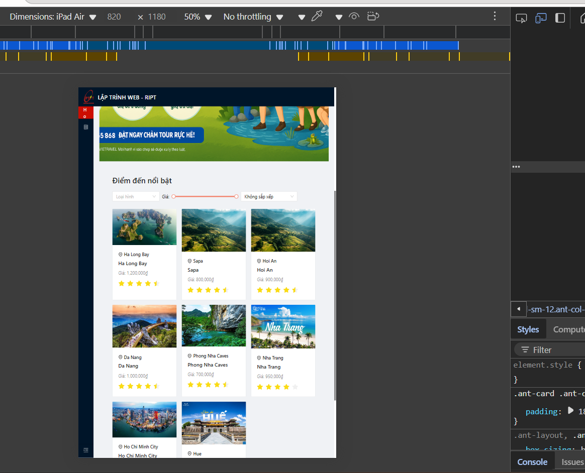
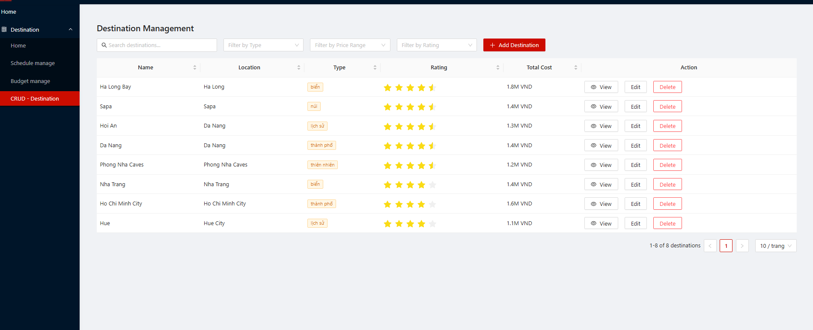
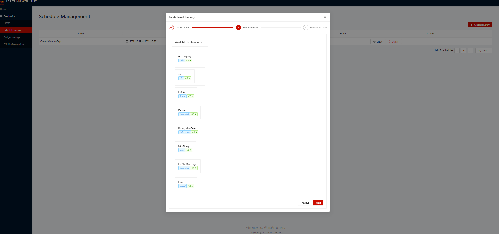
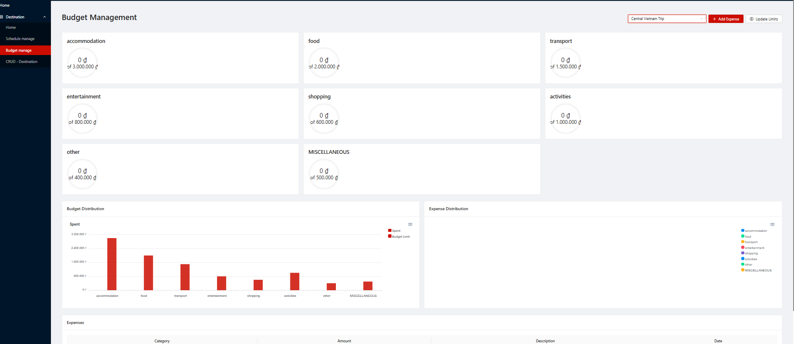

# WEB BASE V3

## Hình ảnh Demo

Dưới đây là một số hình ảnh demo của ứng dụng:


*demo*


*demo*


*demo*


*demo*


*demo*


*demo*


*demo*


*demo*

## Environment Prepare

Install `node_modules`:

```bash
yarn
```

## Provided Scripts

RIPT S-Link provides some useful script to help you quick start and build with web project, code style check and test.

Scripts provided in `package.json`. It's safe to modify or add additional script:

### Start project

```bash
yarn start
```

### Build project

```bash
yarn build
